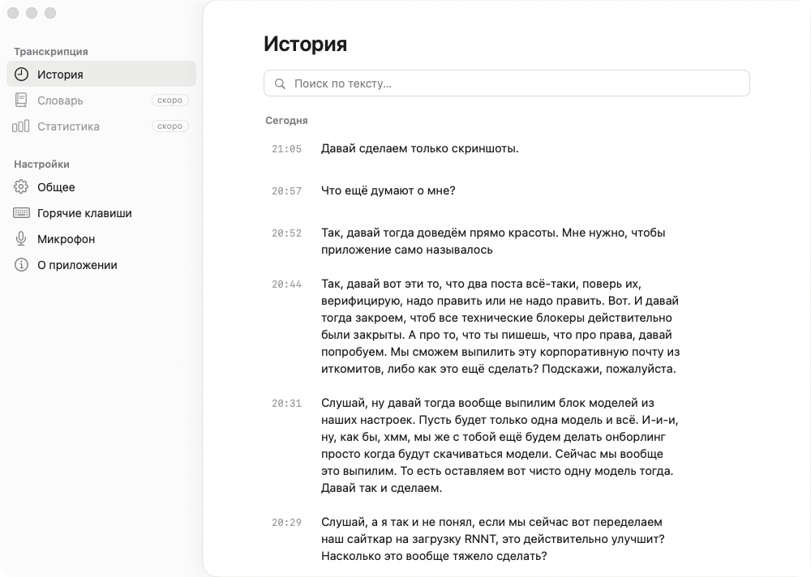
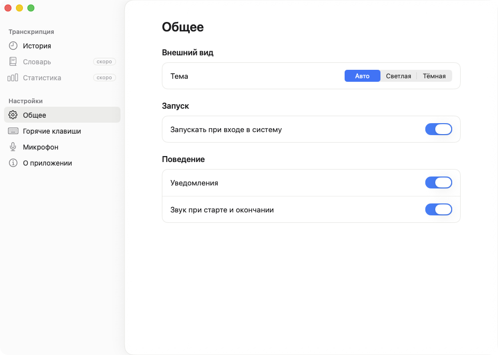

# Golos

Native macOS voice dictation, Wispr Flow–style, with **fully local** speech
recognition via [GigaAM-v3](https://github.com/salute-developers/GigaAM) (ONNX).
Press a hotkey, speak, and the transcribed text is pasted into the active app.
Audio never leaves your machine.

> UI and in-app strings are in Russian; the recognizer targets Russian speech.

## Demo

Hold the hotkey and speak — a pill shows the live waveform. Release, and the
transcript is pasted into the active app.


Every dictation is saved to a searchable history:



The settings window (Codex-style UI):



## How it works

A Swift app handles the UI, global hotkey, audio capture, and paste injection.
A small Rust sidecar (`golos-asr`) runs the ONNX inference. They talk over a
JSON-lines protocol on stdin/stdout, with raw PCM streamed through a named FIFO.

```
hotkey → record → Rust sidecar (GigaAM-v3 ONNX) → transcript → paste
```

## Requirements

- macOS 13 (Ventura) or later
- **Apple Silicon** — Intel (x86_64) is currently unsupported (no prebuilt
  ONNX Runtime for x86_64 via the `ort` dependency)
- [Rust toolchain](https://rustup.rs/) (to build the sidecar)
- Xcode 15+
- The speech model is downloaded on first run (see [Speech model](#speech-model))

## Build

The sidecar is **not** built by Xcode — build it first, then build the app.

```bash
# 1. Build the universal Rust sidecar
bash golos-asr/scripts/build-universal.sh

# 2. Build the app (Xcode copies the prebuilt sidecar into the bundle)
xcodebuild build -project golos.xcodeproj -scheme golos \
  -configuration Debug -destination 'platform=macOS'
```

If you change `golos-asr/src/*.rs`, rebuild the sidecar before rebuilding the app.

## Run

On first launch, the onboarding flow walks you through:

1. **Microphone** access — to capture your voice
2. **Accessibility** access — to register the global hotkey and paste text
3. **Input Monitoring** — to detect the hotkey
4. **Model download** — fetches the GigaAM-v3 ONNX weights

Then hold the hotkey (default: **Right Option**), speak, release, and the text
is pasted into the frontmost app.

## Test

```bash
# Rust (sidecar)
cargo test

# Swift
xcodebuild test -project golos.xcodeproj -scheme golos \
  -destination 'platform=macOS'
```

## Speech model

The GigaAM-v3 weights are **not** bundled in this repository — they are
downloaded on first run.

- The GigaAM-v3 model is published by **SaluteDevices** (Sber) under the
  **MIT License** (since 2024-12) — commercial use, redistribution and
  fine-tuning are permitted, provided attribution is retained.
  Source: [salute-developers/GigaAM](https://github.com/salute-developers/GigaAM).
- The weights are downloaded in **ONNX** form from a third-party conversion,
  [istupakov/gigaam-v3-onnx](https://huggingface.co/istupakov/gigaam-v3-onnx),
  also MIT-licensed and attributing the original.

## License

golos is licensed under the [MIT License](LICENSE).

Third-party components (ONNX Runtime, Rust crates) and their licenses are listed
in [THIRD_PARTY_LICENSES.md](THIRD_PARTY_LICENSES.md). All are permissive
(MIT / Apache-2.0 family).
